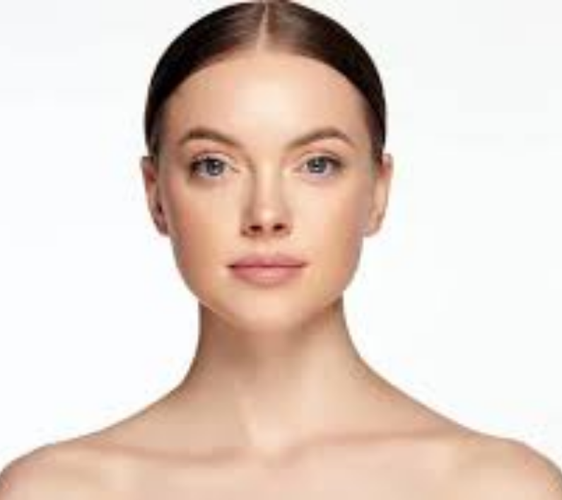
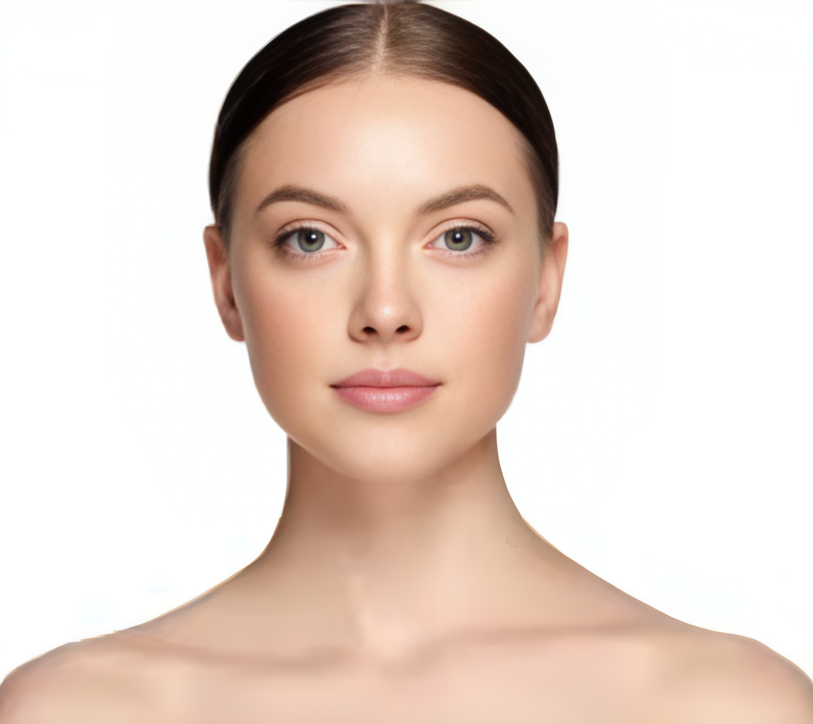
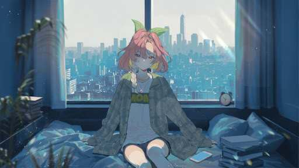
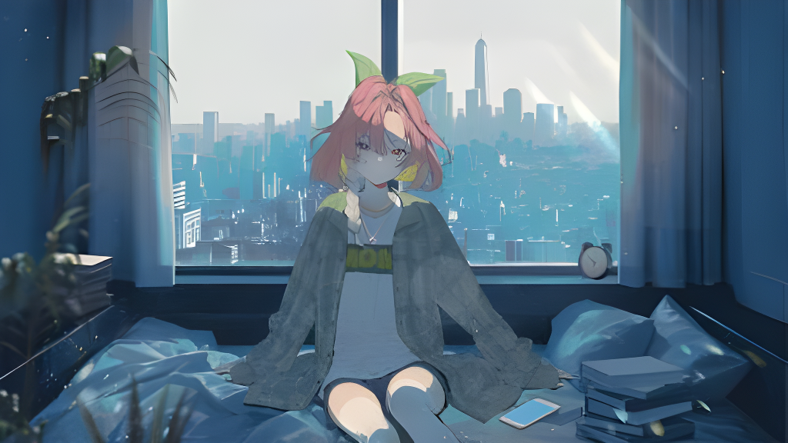

# ImageRepair AI

<div align="center">

| Before (Original Image) | After (Restored Image) |
| :---: | :---: |
|  |  |
|  |  |

</div>

### 🎯 Overview

ImageRepair AI is a powerful, free, and open-source web application that uses advanced AI models to restore, enhance, and repair damaged images. Built with GFPGAN and RealESRGAN, it can fix scratches, reduce blur, enhance details, and upscale images with remarkable quality.

**Key Features:**
- 🤖 AI-powered image restoration using GFPGAN
- 📈 Image upscaling with RealESRGAN (4x resolution enhancement)
- 🌐 Modern web interface with drag-and-drop support
- 🔒 Privacy-focused (images are not stored on servers)
- ⚡ GPU acceleration support
- 🌍 Multi-language support (EN/ZH/JA/KO)
- 🐳 Docker deployment ready

### 📋 System Requirements

#### Minimum Requirements
- **CPU**: Multi-core processor (Intel i5 or AMD Ryzen 5 equivalent)
- **RAM**: 8GB (16GB recommended for large images)
- **Storage**: 5GB free space for models and dependencies
- **Python**: 3.8 or higher
- **OS**: Windows 10+, macOS 10.14+, or Linux Ubuntu 18.04+

#### GPU Requirements (Optional but Recommended)
- **NVIDIA GPU**: GTX 1060 6GB or better
- **VRAM**: 6GB+ for optimal performance
- **CUDA**: Compatible GPU with CUDA 11.8+ support

### 🚀 Quick Start

#### Method 1: Docker Deployment (Recommended)

**For CPU-only systems:**
```bash
# Clone the repository
git clone [https://github.com/diandiancha/ImageRepair-AI.git](https://github.com/diandiancha/ImageRepair-AI.git)
cd ImageRepair-AI

# Build and run CPU version
docker-compose -f docker-compose.cpu.yml up --build
````

**For GPU-enabled systems:**

```bash
# Clone the repository
git clone [https://github.com/diandiancha/ImageRepair-AI.git](https://github.com/diandiancha/ImageRepair-AI.git)
cd ImageRepair-AI

# Build and run GPU version
docker-compose -f docker-compose.gpu.yml up --build
```

Access the application at `http://localhost:5002` (CPU) or `http://localhost:5001` (GPU).

#### Method 2: Python Virtual Environment

**Step 1: Setup Environment**

```bash
# Clone repository
git clone [https://github.com/diandiancha/ImageRepair-AI.git](https://github.com/diandiancha/ImageRepair-AI.git)
cd ImageRepair-AI

# Create virtual environment inside the project directory
python -m venv venv

# Activate virtual environment
# On Windows:
venv\Scripts\activate
# On macOS/Linux:
source venv/bin/activate
```

**Step 2: Install Dependencies**

For CPU-only installation:

```bash
pip install torch torchvision torchaudio --index-url [https://download.pytorch.org/whl/cpu](https://download.pytorch.org/whl/cpu)
pip install -r backend/requirements.txt
```

For GPU-accelerated installation (NVIDIA CUDA required):

```bash
pip install torch==2.1.2+cu121 torchvision==0.16.2+cu121 torchaudio==2.1.2 --extra-index-url [https://download.pytorch.org/whl/cu121](https://download.pytorch.org/whl/cu121)
pip install -r backend/requirements.txt
```

**Step 3: Download AI Models**

```bash
# Create models directory inside backend
mkdir backend/models

# Download GFPGAN model (required)
wget -O backend/models/GFPGANv1.4.pth [https://github.com/TencentARC/GFPGAN/releases/download/v1.3.0/GFPGANv1.4.pth](https://github.com/TencentARC/GFPGAN/releases/download/v1.3.0/GFPGANv1.4.pth)

# Download RealESRGAN model (required)
wget -O backend/models/RealESRGAN_x4plus.pth [https://github.com/xinntao/Real-ESRGAN/releases/download/v0.1.0/RealESRGAN_x4plus.pth](https://github.com/xinntao/Real-ESRGAN/releases/download/v0.1.0/RealESRGAN_x4plus.pth)
```

**Step 4: Run Application**

```bash
python backend/app.py
```

Access the application at `http://localhost:5000`.

### 📁 Project Structure

```
ImageRepair-AI/
├── backend/
│   ├── app.py                 # Flask backend application
│   ├── Dockerfile.cpu         # CPU Docker image
│   ├── Dockerfile.gpu         # GPU Docker image
│   └── requirements.txt       # Python dependencies
├── assets/
│   └── (comparison images)
├── .gitignore
├── docker-compose.cpu.yml     # Docker config for CPU
├── docker-compose.gpu.yml     # Docker config for GPU
├── index.html                 # Frontend web interface
└── README.md                  # This file
```

### 🔧 Configuration

#### Environment Variables

  - `FLASK_ENV`: Set to `production` for production deployment
  - `WORKERS`: Number of processing workers (default: 2)

#### Model Configuration

The application automatically detects and loads available models from the `backend/models` directory:

  - **GFPGAN**: Face restoration and enhancement
  - **RealESRGAN**: General image upscaling and enhancement

### 📊 API Endpoints

| Endpoint | Method | Description |
|----------|---------|-------------|
| `/api/repair` | POST | Start image repair task |
| `/api/status/<task_id>` | GET | Check task status |
| `/api/cancel/<task_id>` | POST | Cancel processing task |
| `/api/health` | GET | System health check |

(Source for all endpoints:)

### 🐳 Docker Deployment Details

#### CPU Version (`docker-compose.cpu.yml`)

  - Port: 5002
  - Optimized for systems without dedicated GPU
  - Lower memory requirements

#### GPU Version (`docker-compose.gpu.yml`)

  - Port: 5001
  - Requires NVIDIA Docker runtime
  - GPU acceleration enabled
  - Higher performance for large images

### 🔍 Troubleshooting

#### Common Issues

**Model Loading Errors:**

```bash
# Ensure models are downloaded into backend/models
ls -la backend/models/
# Should show GFPGANv1.4.pth and RealESRGAN_x4plus.pth
```

**CUDA Out of Memory:**

  - Reduce image size before processing
  - Use CPU version for very large images
  - Adjust tile size in model configuration

**Docker GPU Issues:**

```bash
# Verify NVIDIA Docker support
docker run --rm --gpus all nvidia/cuda:11.8.0-base-ubuntu22.04 nvidia-smi
```

### 🤝 Contributing

Contributions are welcome\! Please follow these steps:

1.  Fork the repository
2.  Create a feature branch
3.  Make your changes
4.  Test thoroughly
5.  Submit a pull request

### 📄 License

This project is open-source and available under the MIT License.

### 🙏 Acknowledgments

  - [GFPGAN](https://github.com/TencentARC/GFPGAN) - Face restoration model
  - [Real-ESRGAN](https://github.com/xinntao/Real-ESRGAN) - Image super-resolution model
  - [BasicSR](https://github.com/XPixelGroup/BasicSR) - Image restoration toolkit

<!-- end list -->

```
```
